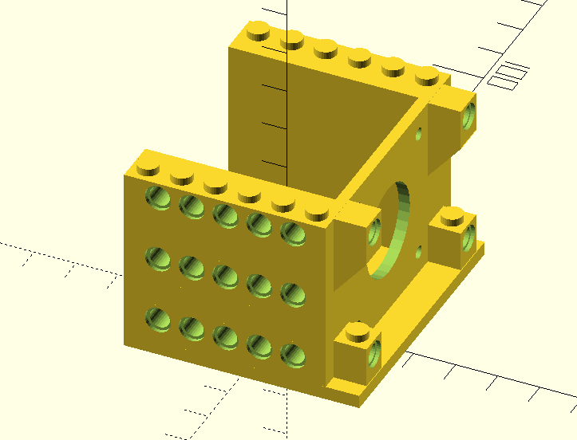
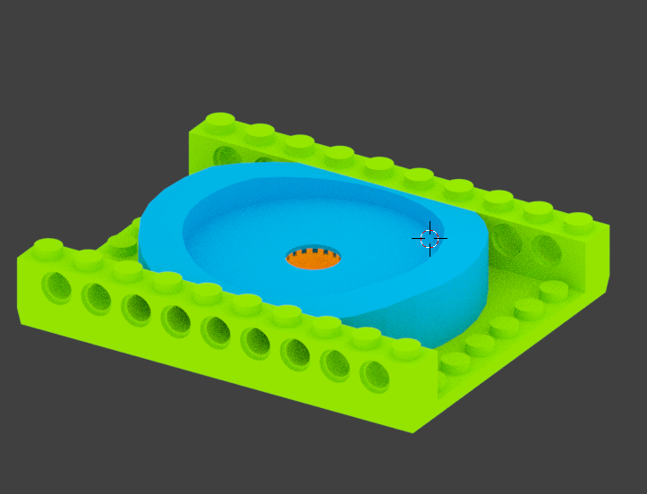
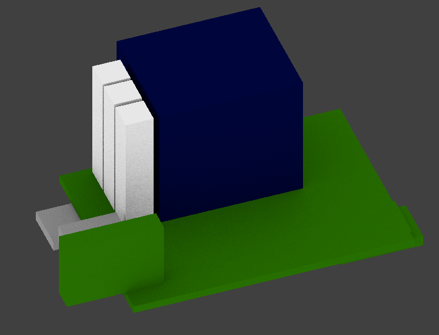
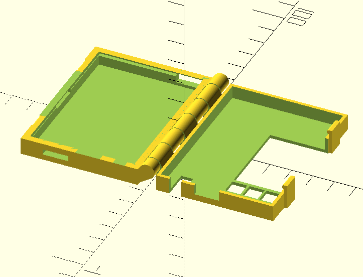

# 3D Models

**As always, work in progress**

This folder contains the 3d print models for stepsie pixie. You will need blender, openscad and a slicer tool of your choice to generate the STL and gcode files needed for printing. 

## Stepper to lego attachment 

 
See `motorblock.scad`

A little attachement for a Nema-17 stepper with lots of oppertunities to connect to lego. 

## Tripod to lego attachment

 
See `tripod.6.blend`

A lego for an incredibly cheap but incredibly well built ball head tripod. 
https://www.amazon.de/Andoer-Kamera-Kugelkopf-Schnellwechselplatte-Schraube/dp/B00JSJXH3Q/

This also requires a large tripod screw to hold the tripod in place. 

## PCB Box (no lego attachment yet)

 
 
* `Hinged_Box_asymtest.scad` The actual box. Print this! 
* `case.1.blend` Coarse layout of the PCB. I use this to make quick 2-layer prints to see if it fits in the real world. 
* `hinge-pcb.stl` STL export of the blender file. This is used in the openscad file to make lots of holes. 

## Library Credits

* Openscad lego library: https://github.com/cfinke/LEGO.scad (MIT License)
* Openscad hinged box: https://www.thingiverse.com/thing:82533 (CC-BY-NC)